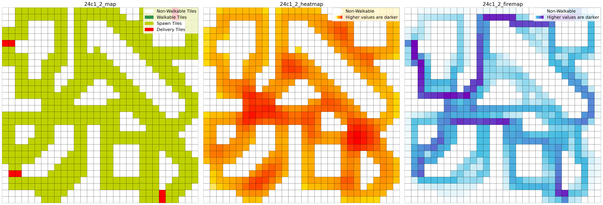
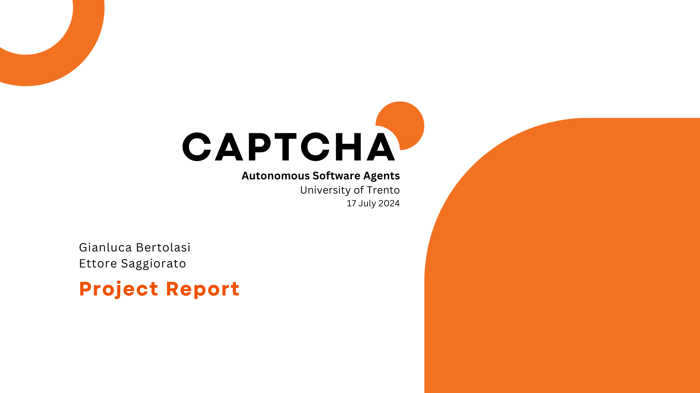

[Project Repo](https://github.com/sa1g/autonomous-software-agents)

Made in collaboration with [Gianluca](https://github.com/bertogb23).

The project is about creating a multi-agent system that can navigate in a simulated environment, using the [Deliveroo.js](https://github.com/unitn-ASA/Deliveroo.js.git) framework. The agents are designed to work together to achieve their goals, and they use PDDL ([planutils](https://github.com/AI-Planning/planutils)) for planning their actions.

Agents can both be run in a single agent mode or in a multi-agent mode. In the multi-agent mode, agents work together to achieve their goals, and they can communicate with each other to coordinate their actions. The cooperative implementaton tries to find a plan that is optimal for the team, while blocking the best path for adversaries. This solution in kind of yielding, where the agents are willing to sacrifice their own performance for the sake of the team.

</a>

Example of map analysis. Green is the map. Orange (darker) representsthe best positions to visualize the spawning of new parcels. Blue (darker) represent the most traveled paths.

To have a better understanding of the maps, static analysis are performed to extract the statically most traveled paths. This information is used to create a heuristic that guides the agents in their planning process. The heuristic is based on the idea that the agents should avoid the most traveled paths, as they are likely to be more congested and less efficient. Also these paths are the ones that adversaries will use to reach their goal and are the ones that we want to block.

As the plans are generated by the PDDL server, to improve the performance of the agents, we implemented a caching system that stores the plans generated by the PDDL server. This allows the agents to reuse previously generated plans, which can significantly reduce the time required to generate new plans. Also a loadbalancing system is implemented to distribute the load of the PDDL server across multiple instances. This allows the agents to generate plans more quickly (lower response times) and efficiently, as they can take advantage of the available resources.

**Known issues**: there is a syncronization bug between agent and the deliveroo server. Sometimes commands are not responded by the server, probably due to a limitation of the server itself.

Click to download slides

