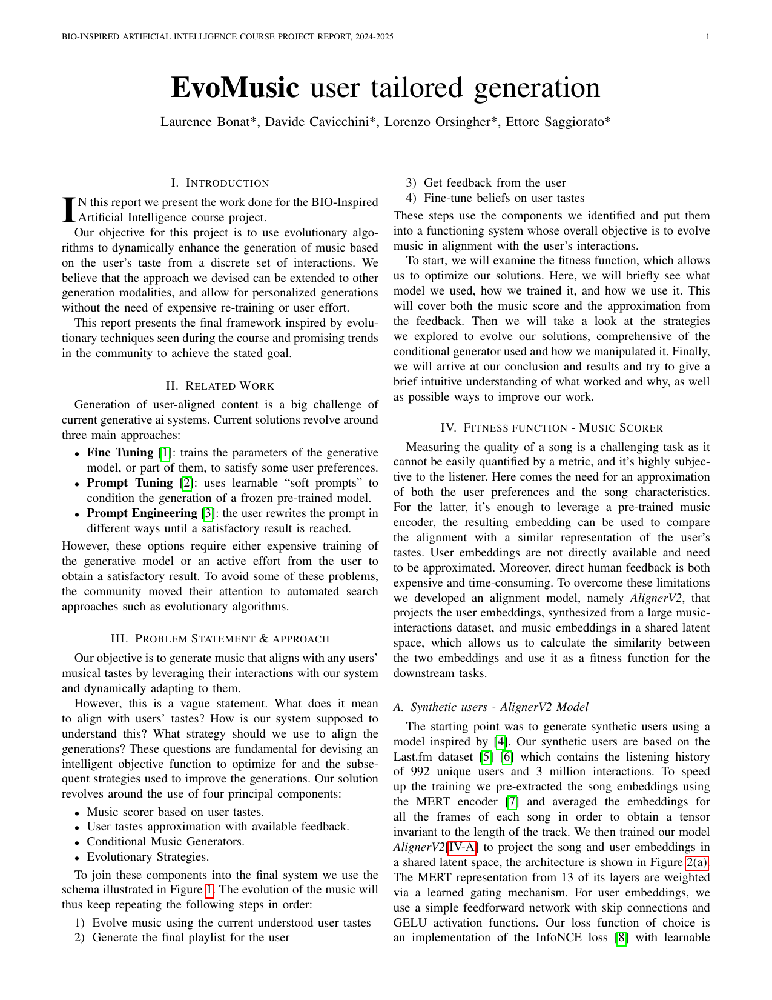

[Project Repo](https://github.com/sa1g/multi-agent-policy-rl)

Made in collaboration with [Davide](https://github.com/DavidC001), [Lorenzo](https://github.com/lorenzoorsingher) and [Laurence](https://github.com/blauer4).

EvoMusic is an adaptive music generation system designed to evolve music in alignment with user preferences. By analyzing user interactions, it continuously refines its understanding of musical tastes and generates personalized compositions.

At its core, EvoMusic combines a music scoring mechanism, user feedback modeling, conditional music generation, and evolutionary strategies. The system follows a loop where it evolves music based on inferred preferences, generates a playlist, collects feedback, and fine-tunes its understanding of user tastes. This iterative process ensures that the music adapts dynamically to each user.

  

    
    
Click to download report

  

  

    
    
Click to download slides

  

