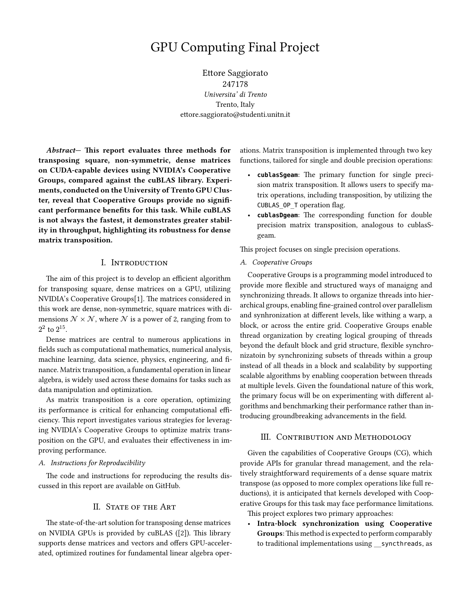

[Project Repo](https://github.com/sa1g/gpu-computing)

These assignments are about learning the basics of GPU programming using CUDA. In all assignment we benchmark non-symmetric matrices of size $N \times N$, where $N$ is a power of 2, with different kernels and block sizes.

Click to download report

## First Assignment

Develop a few algorithms to transpose the matrix in CPU, measure effective bandwidth under different compiler optimizations (-O0, -O1, -O2, -O3), analyze cache behavior and efficiency.

## Second Assignment

Develop a few algorithms to transpose the matrix in GPU, measure effective bandwidth and efficiency.
The developed algorithms are:

- simple transposition
- with shared memory
- with shared memory and coalesced memory access

Results were also compared with the Copy of the matrix in GPU, to compare to the _simplest_ algorithm we could use.

## Third Assignment

Develop some algorithms to transpose the matrix in GPU, using NVIDIA's Cooperative Groups. Compare the results against cuBLAS.
This wasn't straightforward as Cooperative Groups are not a good idea for dense matrix transposition, so I had to _work against_ all the things that were studied during the course.
Three algorithms were developed (ignoring copy):

- Intra-block synchronization (good old `__syncthreads()`)
- Intra-block synchronization coalesced
- Inter-block synchronization (grid-wide synch, expected and demonstrated slower)
