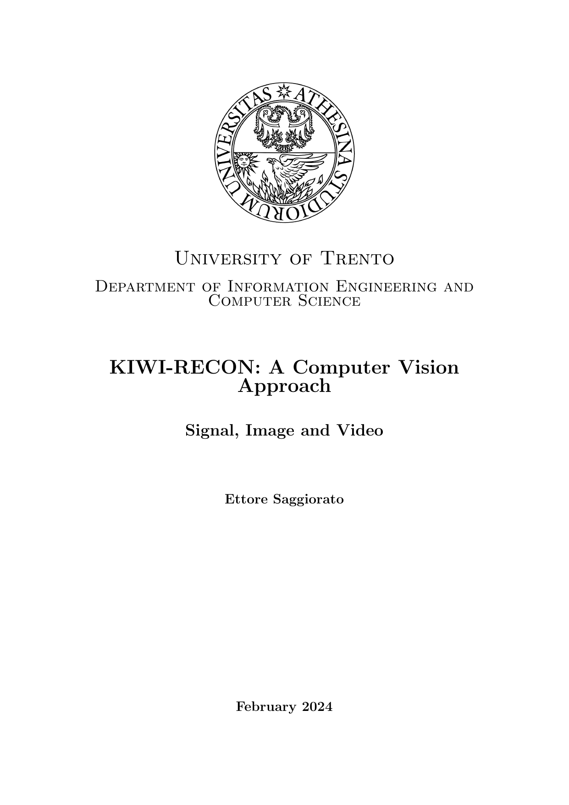
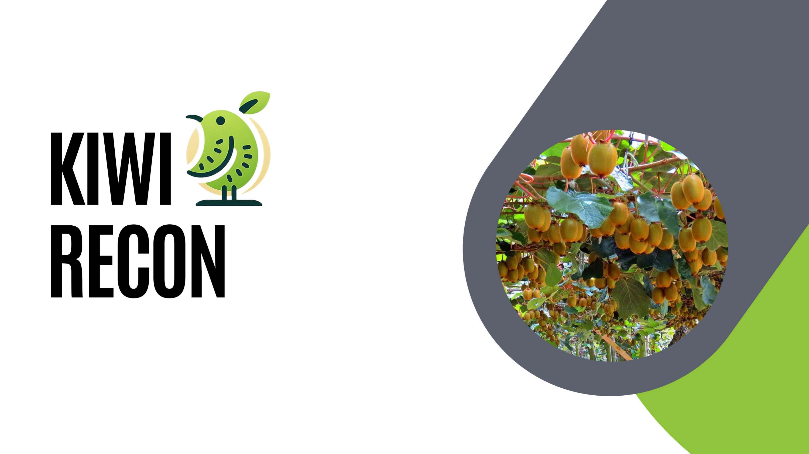

[Project Link](https://github.com/sa1g/kiwi-recon)

This project, developed for the course of _Signal, Image and Video_ focuses on verifying the possiblity to estimate the size of kiwi-fruits from 2D images taken directly on the field, using Machine Learning as little as possible ("only" for getting the masks).
The application of this software could be beneficial for farmers that want to measure the performances of their land, this is just the prototype of what it could be possible to do, such as visualize the production quality identifying plant lines, orchards and, if the software is used by many farmers it could be useful to improve quality, production quantity and research about those.

More infos in the [Report](https://github.com/sa1g/kiwi-recon/blob/main/project%20report.pdf).

  

    
    
Click to download report

  

  

    
    
Click to download slides

  

> This project was fun.
> — <cite>E</cite>

## Future Works

This project could be improved a lot and sent to production (it wasn't a goal for the exam, so I didn't focus on it), some of the improvements could be:

- Use a better (faster, lighter) model for the masks
- Get more data (and augmentation)
- Model the size estimator instead of making everything by hand
- Model the fruit _filtering_ that removes the fruits that are not in the correct position for measurement - here it could be interesting to see if it's possible to model it so that it can estimate the size of the fruit even if it's not in the correct position..pretty hard to do tho.
