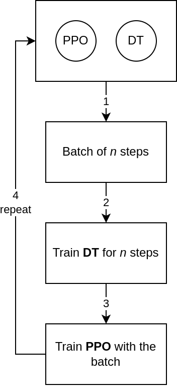

[Project Repo](https://github.com/sa1g/multi-agent-policy-rl)

The idea of this project is to train multiple agents in the [AI Economist](https://arxiv.org/abs/2108.02755) using [PPO v1](https://arxiv.org/abs/1707.06347) and [Decision Trees with Q-Learning](https://arxiv.org/abs/2012.07723) concurrently, to have a fast way to verify the capabilities of the DT in a complex, competitive, scenario. As no existing framework supports batch and online training algos concurrently, I implemented this basic framework.

The issue that different algorithms may have different training speeds is not addressed in this project, developments in this direction are welcome. Currently all algos get the same amount of data. Online algorithms are trained in an online fashion, after each batch of data is collected, and before updating the agents of the batch algorithms.

To make this project run faster, data gatering is distributed across multiple processes (`fork`), and the training is done in a single process. As the project was developed before I learnt about `mpi` and `tensorboard`, it does not use them, and much stuff is hardcoded. A full rewrite could be interesting, also to add the missing feature said above. At the time I tried to use `ray` to distribute the training, but I wasn't able to make it work, so I wrote everything from scratch. The code is not very clean, but it works.

Training scheme for the multi-algorithm training management:

